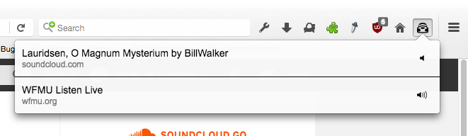
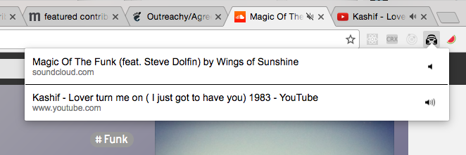

# Sound Control

This is Sound Control, a
[WebExtension](https://developer.mozilla.org/en-US/Add-ons/WebExtensions)
to manage browser tabs that play audio.

It adds a button to the browser toolbar that opens a window with a few features:
* View all tabs that are currently audible
* Jump to any of those tabs
* Mute a single tab
* Jump back and forth between what you're working on and what you're listening
  to
* Mute all tabs
* Automatically mute any audible tabs on startup (coming soon)

Keyboard shortcuts:

* `Control (Command on Mac) + Shift + K`: Kick open the Sound Control panel
* `Arrow Down`: Select the next website in the list
* `Arrow Up`: Select the previous website
* `Enter`: Go to the tab of the selected website
* `m`: Mute / Unmute the selected website
* `M`: Mute / Unmute all websites

Here are some screenshots (which I'm sure are outdated by now):

## Installation

* [Firefox](https://addons.mozilla.org/en-US/firefox/addon/sound-control/)
* [Chrome](https://chrome.google.com/webstore/detail/sound-control/pdpdhkfgennhohnilnjmgiobkiedmaoo?hl=en-US&gl=US)

## Development

Set yourself up with [NodeJS](http://nodejs.org/)
and [yarn](https://yarnpkg.com/). Install all the things:

    yarn install

Start the source builder in your terminal:

    npm run build

## Development in Firefox

Make sure you have
[Firefox Developer Edition](https://www.mozilla.org/en-US/firefox/channel/desktop/)
installed.
Type this in a shell to launch the extension:

    npm start

## Development in Chrome

* Open Chrome
* Go to Window > Extensions
* Tick the box for Developer mode
* Click 'Load unpacked extension...'
* Select the `sound-control/extension` folder

Anytime you edit the source code it will automatically reload in Firefox.
You may have to press command-R to reload it in Chrome depending on what you
changed.

## Icons

The icons for this extension are provided by [icons8](https://icons8.com/)
and [Ionic](http://ionicons.com/).
